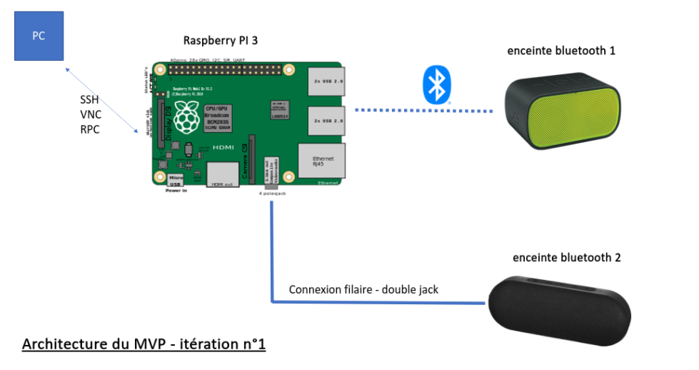

# Innotech MVP :headphones::zap:

Turn your **Raspberry Pi** into a **Bluetooth hub** to play your music through multiple bluetooth **synced** speakers 🔊🔊🔊.

1. [Requirements 📜](<#Requirements 📜>)
1. [Your path to multi-devices sound on Linux ! 🔥](./installation/README.md)
1. [Run from a fresh Raspberry install 🐍](<#Run from a fresh Raspberry install 🐍>)

## Requirements 📜
- Raspberry pi (model 3B used)
- Jack cable
- 2 speakers :
    - 1 in bluetooth mode
    - 1 in AUX mode (connected with JACK cable to the headphone output of the Raspberry)
    

## Run from a fresh Raspberry install 🐍
```bash
# install bluebox server and bluetool
git clone https://github.com/bluebox-insa/bluebox.git
sudo ~/bluebox/installation/install.sh
source ~/.bashrc
git clone https://github.com/bluebox-insa/bluetool.git
cd bluetool && sudo make install && cd ~

# to run the server, relaunch init.sh
sudo ~/bluebox/init.sh
```
