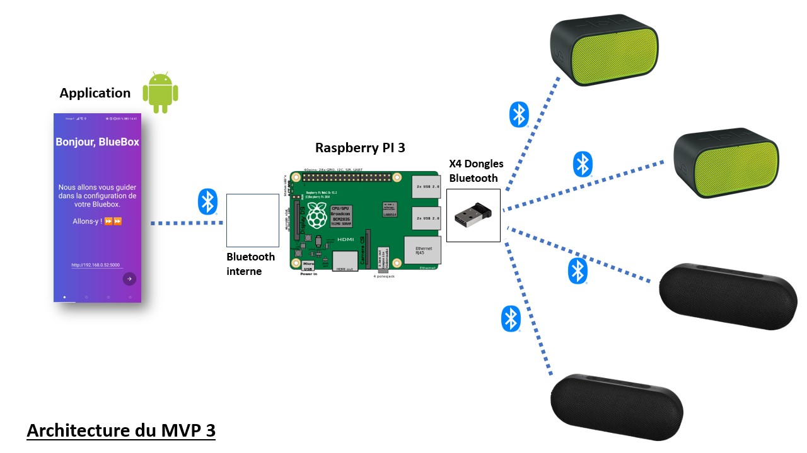

# Bluebox MVP :headphones::zap:

<p align="center">
  
</p>

Turn your **Raspberry Pi** into a **Bluetooth hub** to play your music through multiple bluetooth **synced** speakers 🔊🔊🔊.

<p align="center">
  
</p>

1. [Demo](<#Demo 📱>)
2. [Requirements 📜](<#Requirements 📜>)
3. [Your path to multi-devices sound on Linux ! 🔥](./installation/README.md)
4. [Run from a fresh Raspberry install 🐍](<#Run from a fresh Raspberry install 🐍>)
5. [Comments](<#Comments>)

## Demo 📱

<p align="center">
    
</p>

## Requirements 📜
- Raspberry pi (model 3B used)
- Up to 4 speakers in bluetooth mode
- 4 bluetooth dongles (tested with Baseus USB Bluetooth adaptateur : [Baseus USB Bluetooth adaptateur on Aliexpress](https://www.aliexpress.com/item/1005001829990800.html?spm=a2g0o.productlist.0.0.18a03959VMyWgE&algo_pvid=7c0e1fa6-38fd-49ef-9d7c-fb7c29c74d0a&algo_expid=7c0e1fa6-38fd-49ef-9d7c-fb7c29c74d0a-0&btsid=2100bdde16101020065588400ef738&ws_ab_test=searchweb0_0,searchweb201602_,searchweb201603_))
- Android smartphone with [BlueBox](https://play.google.com/store/apps/details?id=com.bluebox.bluebox) installed from PlayStore

## Run from a fresh Raspberry install 🐍
```bash
# install bluebox server and bluetool
git clone https://github.com/bluebox-insa/bluebox.git
cd bluebox && sudo make install
git clone https://github.com/bluebox-insa/bluetool.git
cd bluetool && sudo make install

# to configure and launch the server, please reboot
sudo reboot now
```

:ambulance: See [here](./latency-optimization/README.md) to reduce the latency between your speakers

## Comments 
- To configure the raspberry using bluebox app (https://github.com/bluebox-insa/bluebox-android-app), the smartphone and the raspberry must be connected on the same network. Please check ip address of your raspberry (same as flask server).
- Last version of the Bluebox application is also available in this repo : https://github.com/bluebox-insa/bluebox-android-app