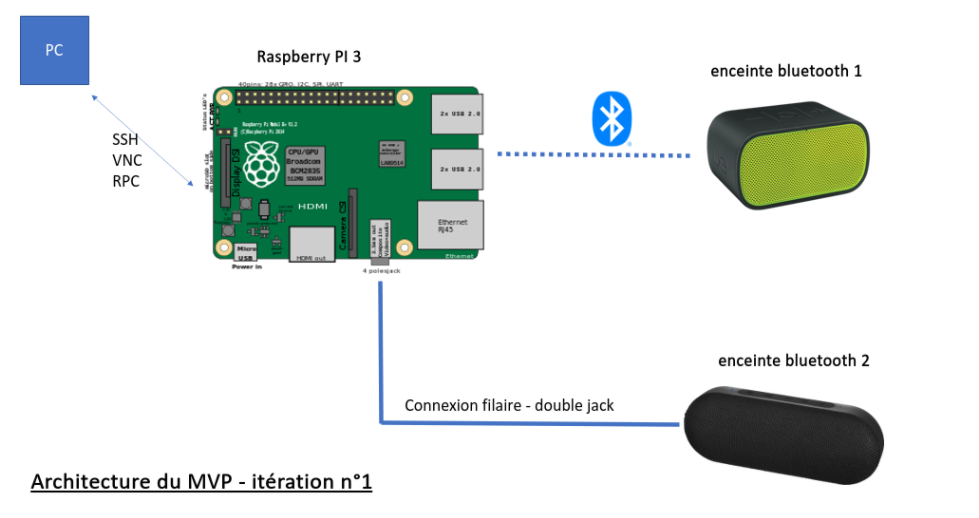

# Innotech MVP :headphones::zap:

Turn your raspberry pi into a Bluetooth hub to play your music through multiple bluetooth speakers 🔊🔊🔊.

1. [Requirements 📜](<#Requirements 📜>)
1. [Your path to multi-devices sound on Linux ! 🔥](./installation/README.md)

1. [Troubleshooting 🛠](<#Troubleshooting 🛠>)

## Requirements 📜
- Raspberry pi (model 3B used)
- Jack cable
- 2 speakers :
    - 1 in bluetooth mode
    - 1 in AUX mode (connected with JACK cable to the headphone output of the Raspberry)
    

## Install des modules pythons
```bash
    pip install flask pybluez Flask-JSON
    flask run
```

[Source - Flask JSON](https://pypi.org/project/Flask-JSON/)
