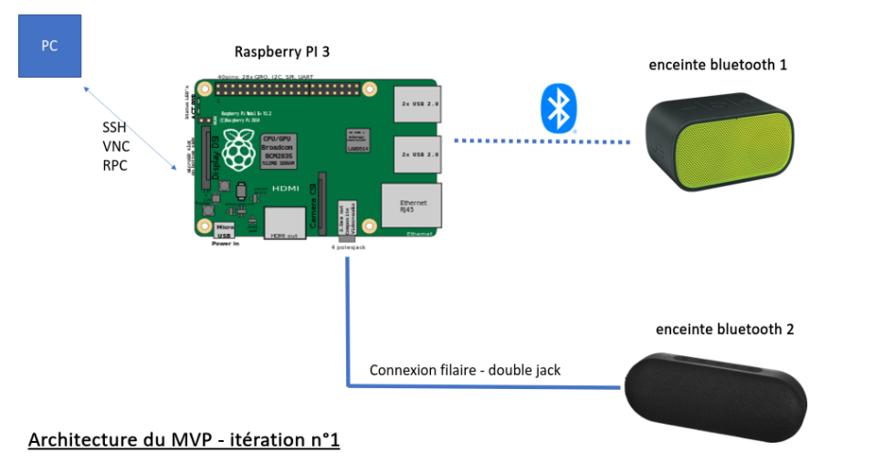

# Walkthrough 👨‍👩‍👧‍👦🔊🔊🔊

1. [Requirements 📜](<#Requirements 📜>)
1. [Getting started 🚦](<#Getting started 🚦>)
1. [Your path to multi-devices sound on Linux ! 🔥](<#Your path to multi-devices sound on Linux ! 🔥>)
1. [Set-up VLC remote server 🤖](<#Set-up VLC remote server 🤖>)
1. [Troubleshooting 🛠](<#Troubleshooting 🛠>)

## Requirements 📜
- Raspberry pi (model 3B used)
- Jack cable
- 2 speakers :
    - 1 in bluetooth mode
    - 1 in AUX mode (connected with JACK cable to the headphone output of the Raspberry)

    

## Getting started 🚦

> If you want to setup your raspberry without external monitor, HDMI cable etc. You can follow [this](https://desertbot.io/blog/headless-raspberry-pi-3-bplus-ssh-wifi-setup) tutorial.

- **Install the raspbian OS on the SD card and make sure everything is up to date** by running the following commands:

```bash
sudo apt-get update
sudo apt-get upgrade
sudo apt-get autoremove
```

>Note : set-up the ssh server on ther raspberry to use it remotely

>**The beginning of this walkthrough is inspired from this french [tutorial](https://www.coxprod.org/domotique/pulseaudio-pour-enceinte-bluetooth/2/)**

## Your path to multi-devices sound on Linux ! 🔥

1. Make sure that bluealsa is not installed to avoid potential conflicts:
    ```bash
    sudo apt-get remove bluealsa
    ```
1. Install pulseaudio and pulseaudio-module-bluetooth
    ```bash    
    sudo apt-get install pulseaudio pulseaudio-module-bluetooth
    ```
    Start pulseaudio 
    
    ```bash
    pulseaudio --start
    ```
    
1. add users to user groups
    ```bash
    sudo adduser pi audio
    sudo adduser root audio
    sudo adduser pulse audio
    sudo adduser pi pulse-access
    sudo adduser root pulse-access
    ```
    > This is not necessary but will be if we want to turn pulseaudio into a service

1. connect one bluetooth speaker to the raspberry
    ```bash
    bluetoothctl
    power on
    agent on
    default-agent
    scan on
    ```
    You should then see the bluetooth devices that surround you. Retrieve the desired device MAC address (under the following format : xx:xx:xx:xx:xx:xx).
    
    You can then connect to it :
    
    ```bash
    scan off
    pair xx:xx:xx:xx:xx:xx
    trust xx:xx:xx:xx:xx:xx
    connect xx:xx:xx:xx:xx:xx
    ```
5. Configure Pulseaudio as the default sound manager by editing `/etc/asound.conf`

    You can use nano for instance:
    ```bash
    sudo nano /etc/asound.conf
    ```

    And paste this :

    ```bash
    pcm.pulse {
        type pulse
    }
         
    ctl.pulse {
        type pulse
    }
         
    pcm.default pulse
    ctl.default pulse
    ```

    We do the same for `~/.asoundrc` and paste the same configuration
    
    ```bash
    cd
    nano .asoundrc
    ```
1. Configure single output device
    ```bash
    pacmd list-cards
    ```
    You should see several indexes relative to each sound device you have.
    
    One index corresponds to your bluetooth device.

    For instance
 
    ```bash
    index: 2
    name: <bluez_card.xx_xx_xx_xx_xx_xx>
    driver: <module-bluez5-device.c>
    owner module: 26
    properties:
            device.description = "BLP9820"
            device.string = "xx:xx:xx:xx:xx:xx"
            device.api = "bluez"
            device.class = "sound"
            device.bus = "bluetooth"
            device.form_factor = "hands-free"
            bluez.path = "/org/bluez/hci0/dev_xx_xx_xx_xx_xx_xx"
            bluez.class = "0x240408"
            bluez.alias = "BLP9820"
            device.icon_name = "audio-handsfree-bluetooth"
            device.intended_roles = "phone"
    profiles:
            headset_head_unit: Headset Head Unit (HSP/HFP) (priority 30, available: unknown)
            a2dp_sink: High Fidelity Playback (A2DP Sink) (priority 40, available: unknown)
            off: Off (priority 0, available: yes)
    active profile: <a2dp_sink>
    sinks:
            bluez_sink.xx_xx_xx_xx_xx_xx.a2dp_sink/#3: BLP9820
    sources:
            bluez_sink.xx_xx_xx_xx_xx_xx.a2dp_sink.monitor/#3: Monitor of BLP9820
    ports:
            handsfree-output: Handsfree (priority 0, latency offset 0 usec, available: unknown)
                    properties:

            handsfree-input: Handsfree (priority 0, latency offset 0 usec, available: unknown)
                    properties:
    ```

    You can then set your bluetooth device profile : A2DP provides the best quality thank to the `INDEX_NUMBER` given by the `pacmd list-cards` command corresponding to the bluetooth *sink*(otherwise you can take profit of the auto-completion using TAB key to provide the full name): 
    
    ```bash
    pactl set-card-profile INDEX_NUMBER a2dp_sink
    ```   

    **Test your bluetooth speaker !**
    Run the following commands to play a sample song through your bluetooth speaker !
    ```bash
    wget https://file-examples-com.github.io/uploads/2017/11/file_example_MP3_1MG.mp3
    cvlc file_example_MP3_1MG.mp3
    ```

1. Install **paprefs**
    
    ```bash
    sudo apt-get install paprefs
    ```
    
    As we will need to acces the GUI of the raspberry you can either :
    - Connect you raspberry to a screen and a mouse with HDMI & USB
    - install *tightvncserver* to access it remotely : 
        ```bash
        sudo apt-get install tightvncserver
        tightvncserver
        ```
        >See the tutorial [here](https://www.raspberrypi.org/documentation/remote-access/vnc/) in order to connect to your VNC server from your computer
    
    Once you have access to your Raspberry GUI
    - launch a new terminal and launch `paprefs`
    - check the *Add virtual output device for simultaneous output on all local sound cards* option in the **Simultaneous Output panel**
    
    - close the window and issue the commands 
        ```bash
        pulseaudio -k # kill any previous pulseaudio instance
        pulseaudio --start
        ```
1. **Download a sample song and try our setup !**
    
    >Make sure that you turned on your speakers and that it is still connected to your raspberry by checking the bluetooth icon on the status bar of the rasbian GUI
    
    - In the terminal :
    ```bash
    vlc file_example_MP3_1MG.mp3
    ```

    Select the *Simultaneous output* option
    

    After a couple of seconds, some sound should come up from your two speakers !


## Set-up VLC remote server 🤖

You can setup a server using vlc which allows to control the music using just one single command !

```bash
nvlc --intf http --http-host RASPBERRY_IP --http-password YOUR_PASSWORD MUSIC_FILEPATH
```

You can then open a browser on : http://RASPBERRY_IP:8080/ and enjoy a great GUI


## Troubleshooting 🛠

- **Delay problems**

    This is currently the main problem of this set-up and we are working on it.

    For now we know that after playing a sufficiently long, the buffers should find their way to sync. However we can help them a lot to do it sooner by tuning the output-delay.

    In order to achiebe this :
    ```bash
    pactl list
    ```
    You should get a similar output for you bluetooth card index :

    ```bash
    Card #2
            Name: bluez_card.xx_xx_xx_xx_xx_xx
            Driver: module-bluez5-device.c
            Owner Module: 26
            Properties:
                    device.description = "BLP9820"

            #############################
            #  Irrelevant lines skipped #
            #############################

            Active Profile: a2dp_sink
            Ports:
                    handsfree-output: Handsfree (priority: 0, latency offset: 1000000 usec, available)
                            Part of profile(s): headset_head_unit, a2dp_sink
                    handsfree-input: Handsfree (priority: 0, latency offset: 0 usec)
                            Part of profile(s): headset_head_unit
    ```

    Notice the `Ports` section. Usually you will find one for the output & one for the input.

    For the `handsfree-output` I set-up a specific `latency offset` of **1 second**. Depending on the devices you are using, the optimal value changes. As a result you can help the synchronization by providing it. The procedure is as follows :

    **Be careful, delay is in microseconds : 10^(-6)seconds !!!**
    
    ```bash
    pactl set-port-latency-offset bluez_card.xx_xx_xx_xx_xx_xx handsfree-output DESIRED_DELAY
    pactl set-card-profile bluez_card.xx_xx_xx_xx_xx_xx off
    pactl set-card-profile bluez_card.xx_xx_xx_xx_xx_xx a2dp_sink
    ```

- Unable to connect to my bluetooth speaker using `bluetoothctl`
    - Make sure pulseaudio is running :
        ```bash
        pulseaudio -k # kill any previous pulseaudio instance
        pulseaudio --start
        ```