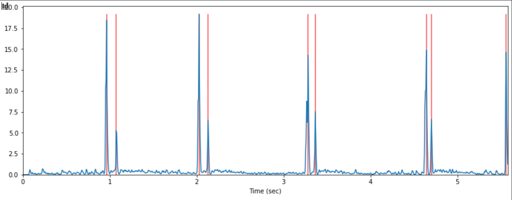

# Syncing multiple speakers :construction:
We aim at syncing speakers by tuning the delay in the raspberry config : see [here](../installation/README.md) in the Troubleshooting section.

In order to automatically find this value, we approache the problem with specific signals.

## Main ideas to find the delay using `librosa` :

We will send at the same time (from the point of view of the raspi) a 'beep' :sound: sound and record at the same time the output.

1. Play *beep* sounds
    - using high frequency signals
    - send a different frequency per speaker ???

1. Record speakers
    - Using Android app + send back to flask server on rapsi
    - Using USB microphone directly with raspi

1. Detect peaks
    - wait for speaker synchronization
    - filter signals per frequency to reduce noise
    - Average measures by playing multiple beeps

1. Confirm Adjustment
    - Adjust delay iteratively => Show 'OK' when done (especially if frequency cannot be heard)
    - Provide user-friendly UI to allow user to adjust it anyway !
